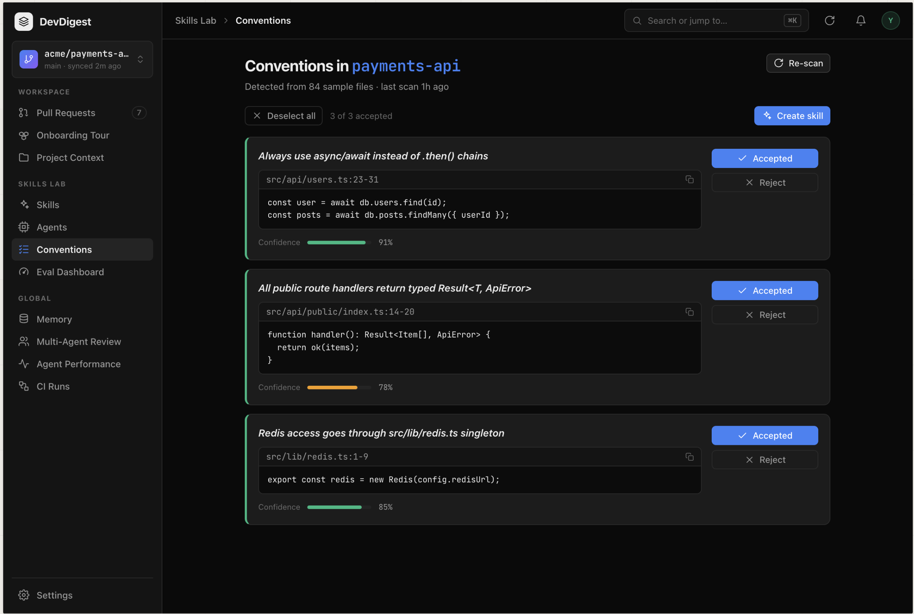
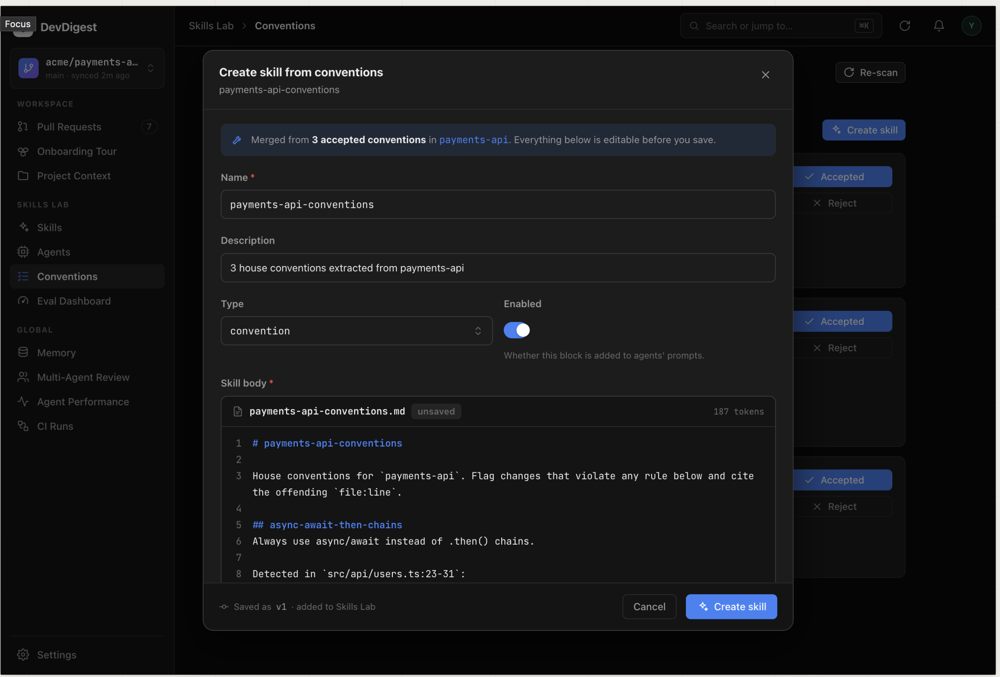

# Homework №2 — Conventions Extractor + custom review agent with skills (API Contract Reviewer)

> Grading criteria for this assignment: [hw2-acceptance-criteria.md](./hw2-acceptance-criteria.md)

## What we are doing

We are building a feature that **analyzes code-style conventions in a repository and proposes turning them into a skill**.

Most of the findings may indeed be invalid — but some of them can genuinely be refined into a useful skill that captures your project's rules. An additional challenge is to think about **how to improve this feature at the product level** so that it yields either *more* findings or findings of *better quality*.

## Prior art: Claude Code `/insights`

Claude Code offers similar insights derived from your chat history. You can see them by typing `/insights` in the console. At the bottom of that page it proposes:

- appending specific lines to `CLAUDE.md`,
- creating Custom Skills,
- or new ways to use Claude Code.

Our feature does the same thing, but the source of insights is the **repository code**, not the chat history.

## User journey

As a user I can:

1. **Run an analysis** of the repository for Conventions.
2. **See all found Conventions** (candidate list).
3. **Accept / reject** a specific insight.
4. **Edit** a specific insight.
5. **Open the skill-editing modal** pre-filled with the insights I selected.
6. **Edit the future skill text** — both the body (built from the insights) and the metadata.
7. **Save the skill** or **back out** of it.

## Possible implementation — Conventions Extractor

1. **Storage + API**: create a `conventions` table and a `POST /repos/:id/conventions/extract` route.
2. **Sample selection — pure code, no model**: config files (eslint, tsconfig, prettier) + top-12 files via the existing `repoIntel.getConventionSamples()` method.
3. **Model call**: invoke a cheap model to analyze the repository (this functionality may already be partially implemented). The model must return a list of candidates:
   ```
   { category, rule, evidence: file + line, confidence }
   ```
4. **Evidence verification in code**: for each candidate, check against the project files — does the file exist? does that code line exist? Candidates without verified evidence are discarded.
5. **UI**: a list of candidates with **approve / reject** buttons.
6. **Skill assembly**: collect approved candidates into a single `repo-conventions` skill and link it to an agent (using the mechanism from the lab).

**Alternative / broader direction:** instead of one merged skill, generate **multiple skills** from the findings.

## Action plan — API Contract Reviewer

1. **Create the agent.** Create an *API Contract Reviewer* agent through the UI, using the functionality built in the lab. The idea: this agent finds **API problems in a PR** while reviewing it. For the agent's own prompt and the skill prompts, you can draft them in Claude Code (or whichever tool you use) following good practices.

2. **Write 3–4 skills** for it, each with a directive description and a "good / bad" example:
   - **breaking-change** — changing or removing a public contract;
   - **response-schema** — changes in the response shape (field types, requiredness);
   - **semver-discipline** — when a change requires a major version bump;
   - **deprecation-policy** — how to mark something deprecated instead of silently removing it.

3. **Attach the skills** to the agent in the **Skills** tab; register at least one of them **via import**, to walk that path once more.

4. **Run the experiment.** Take a PR (or create one) that changes a route signature or renames a field in the response:
   - run **without skills** → the agent misses the problem;
   - run **with skills** → the agent catches the breaking change and writes review comments.

## UI reference (mockups)

The full interactive prototype is in this folder: [devdigest-design-standalone.html](./devdigest-design-standalone.html) (open it in a browser — single-file React app, includes the Conventions screen).

The assignment comes with two mockups of the Conventions feature:

1. **Conventions page** (`Skills Lab → Conventions`):
   - header "Conventions in *payments-api*", "Detected from 84 sample files · last scan 1h ago", **Re-scan** button;
   - selection controls: *Deselect all*, "3 of 3 accepted" counter, **Create skill** button;
   - candidate cards, each showing: the rule title, evidence `file:line` with a code snippet and copy button, a **Confidence** bar with a percentage (e.g. 91% / 78% / 85%), and **Accepted** / **Reject** buttons.
   - Example candidates: "Always use async/await instead of `.then()` chains" (`src/api/users.ts:23-31`), "All public route handlers return typed `Result<T, ApiError>`" (`src/api/public/index.ts:14-20`), "Redis access goes through `src/lib/redis.ts` singleton" (`src/lib/redis.ts:1-9`).

   

2. **"Create skill from conventions" modal**:
   - pre-filled Name (`payments-api-conventions`), Description, Type (`convention`), Enabled toggle;
   - editable **Skill body** as a markdown file (`payments-api-conventions.md`, token counter), generated from the accepted conventions — each rule becomes a `##` section citing its evidence `file:line`;
   - footer note "Saved as v1 · added to Skills Lab", **Cancel** / **Create skill** buttons.

   
