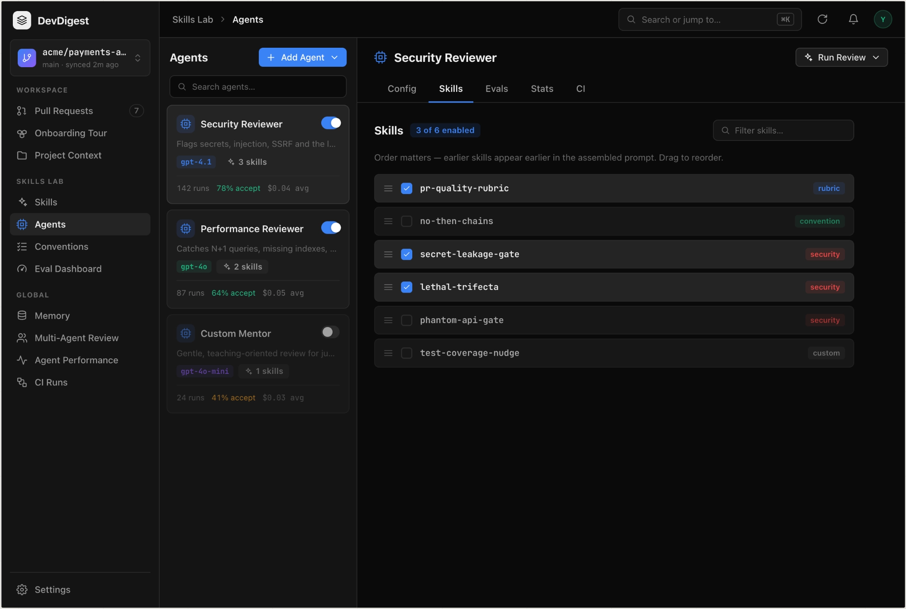

# Implementing the skills feature for review agents

**Storage and skill list**

- A server module with CRUD over the skills table; the database is the source of truth.
- UI: a Skills page with a grid of cards (name, type, description, an "enabled" toggle); a click opens a preview in a side panel; an "add" button offering a choice of "create / import".

**Skill editor**

- Form: name, description, type, body in markdown.
- The description is the skill's interface — we phrase it as a directive; in the UI we hint at this with a caption under the field.

**Attaching to an agent**

- UI: a Skills tab in the agent editor — linking, enabling/disabling, changing the order.
- The order determines the sequence of blocks in the prompt.

**Import**

- Upload a markdown file or an archive; the product extracts the skill's core and shows a preview.
- Saving happens only after confirmation; executable parts of the archive are not processed.
- In the video we separately discuss trust: someone else's skill is someone else's instructions inside the agent's prompt.

**New agent**

- Test Quality Reviewer — checks test quality: uncovered branches, missed corner cases, excessive mocking, flakiness.
- Each agent gets its own skills attached; at least one is added via import, to walk the whole path.

**Control experiment**

- Test Quality: a PR with a happy-path-only test → without skills (miss) vs. with skills (flags the uncovered branch and the boundary case).
- API Contract: a PR that changes a route signature → without skills (miss) vs. with skills (detects the breaking change).
- Open the run trace → the prompt-assembly section; we see the skills block and the tokens it added.

**Final check**

- `pr-self-review` exists with auto-invocation disabled; we invoked it manually and saw it pull in both the frontend and the backend skills.
- A skill is created and edited in the UI.
- Both new agents have skills attached.
- An enabled skill is visible in the logs as a separate block; a disabled one is not.
- Import went through the preview; executable code was never run.
- The control experiment is reproduced on both agents.
